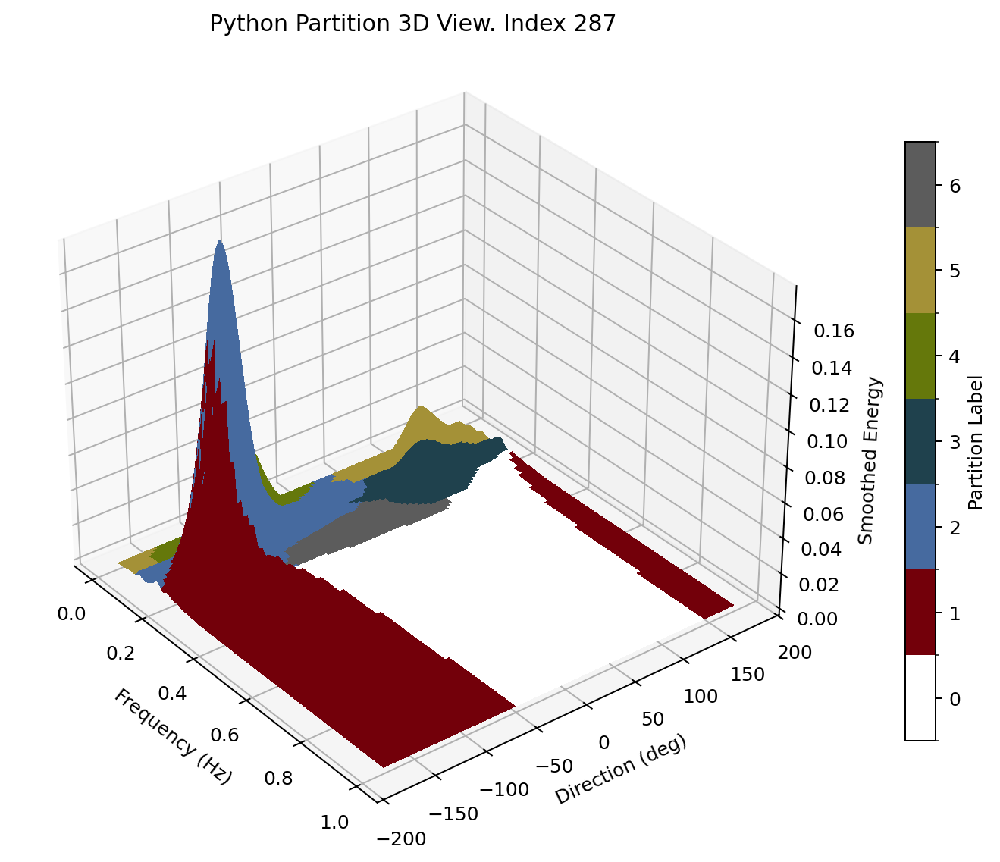

# WavePart Python



WavePart Python is a clean Python package for partitioning directional wave spectra into wind sea and multiple swell components. The repository is organized for direct Python use, includes a compact command-line interface, and ships with a Python-native sample dataset so a new user can run it immediately.

## Install

```bash
python3 -m venv .venv
source .venv/bin/activate
python -m pip install -U pip
python -m pip install -e .[plot,dev]
```

## Quick Start

Use the bundled sample dataset:

```bash
wavepart partition data/sample_spectra.npz --index 1 --output out/partition_case.npz
wavepart wind-limits data/sample_spectra.npz --output out/wind_limits.npz
wavepart demo data/sample_spectra.npz --index 287 --output-dir out/demo
```

Use the package directly:

```python
import numpy as np
from wavepart import partition_spectrum, compute_partition_params

with np.load("data/sample_spectra.npz") as data:
    freq = data["freq"]
    direction = data["direction"]
    spectrum = data["spectra"][:, :, 0]

partition = partition_spectrum(freq, direction, spectrum)
params = compute_partition_params(
    partition.smoothed_spectrum,
    freq,
    direction,
    partition.labels,
    depth=30.0,
)
```

## Dataset Format

The package expects `.npz` files with these keys:

- `freq`
- `direction`
- `spectra`
- `time` (optional)

The bundled sample file follows that format directly.

## What Is Included

- `src/wavepart`: core package
- `data/sample_spectra.npz`: ready-to-run example dataset
- `tests`: regression, CLI, and plotting tests
- `docs/assets/wavepart-3d.png`: package preview image

## Verification

Run the full test suite:

```bash
pytest
```

Current tests cover:

- reference regression cases
- wind-limit regression
- flat-spectrum and label invariants
- CLI smoke checks
- plotting smoke checks

## Origin

This Python implementation is based on the original WavePart work by Douglas Cahl and George Voulgaris. The original repository remains available here:

- https://github.com/gvoulgaris0/WavePart

## License

This repository is distributed under the GNU General Public License v3.0. See [LICENSE](LICENSE).
